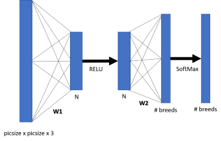

# DogClassifier
A CNN Dog Classifier in python 3 w/Tensorflow.  WIP

## Data Understanding
Starting with the Stanford Dog Dataset: [ImageNetDogs](http://vision.stanford.edu/aditya86/ImageNetDogs/).  This gives me:
> * **Number of categories:** 120
> * **Number of images:** 20,580
> * **Annotations:** Class labels, Bounding boxes

The images have the following characteristics:
* *jpg* format
* No uniform size
* Some have humans in them
* Some have multiple dogs
* Largest Dimension: 3264

## Data Preparation
The file (dog_images.py)[https://github.com/NeverForged/DogClassifier/blob/master/Source/dog_images.py] takes the [ImageNetDogs](http://vision.stanford.edu/aditya86/ImageNetDogs/) and labels them, places them in folders, normalizes them to a specified size, and mirror images them to double the dataset size.  It also resizes them to squares of a specified pixel size, creating a set of training and test files that are picsize x picsize squares, with white borders along the shorter edge of the picture.

I then use some basic shuffle techniques to shuffle my data around (to avoid it only being trained on the last breed sent through it.)

## Modeling
A number of models were tried to classify dog breeds based on photos; see [ipython notebook](https://github.com/NeverForged/DogClassifier/blob/master/Source/DogClassifier.ipynb) for details.

First I tried a fully connected network with no hidden layers with the following structure:

This was usually not better than chance; it was around 60% when comparing Beagles to Great Danes, but when running five dog breeds, it was about 25% accurate.

Using a single hidden layer as such:

Where N is some number of hidden features, and searching over N as 1-10 times the number of breeds (so 5, 10, ..., 45, 50), I found that it was sometimes worse, sometimes better, but never better than around 40%, which is not an ideal classifier.

To be honest, I wasn't convinced the above would work in the first place, especially given that the placement and positioning of dogs in the photos is arbitrary.  Maybe this would work if all photos were dogs in the same position taken at a specified distance from the dog, but otherwise there is no theoretical reason to think this would work without convolutions.

Now to create a convoluted neural network.  Setting it up to use variables, so I can reconstruct it as a class (using sklearn methods) and grid search it to find the best parameters for the situation.

Of course, now I have to grid-search the variables.
